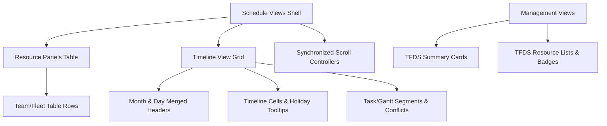

# Documentação de Migração — Fase 14B: Team / Fleet Schedule Views

## 1. Visão Geral e Princípios
A Fase 14B executou a migração visual e estilística controlada das telas operacionais de **Programação e Gestão de Recursos (Equipes e Frota)** para o **TaskFlow Design System (TFDS)**.

A prioridade absoluta e o contrato de segurança foram mantidos:
```text
RESOURCE SCHEDULING STABILITY
>
CONFLICT DETECTION INTEGRITY
>
PERIOD / DATE INTEGRITY
>
SCROLL SYNCHRONIZATION
>
TASK / RESOURCE RELATIONSHIPS
>
TFDS COVERAGE
>
VISUAL MODERNIZATION
```

---

## 2. Escopo Migrado
- `lib/widgets/team_schedule_view.dart`: Shell, toolbar, linha de meses/dias mesclados, grid temporal, células de divisão/empresa/função/matrícula/tarefas/nome com tokens semânticos e indicação de conflito via TFDS.
- `lib/widgets/fleet_schedule_view.dart`: Shell, toolbar, linha de meses/dias mesclados, grid temporal, células de regional/divisão/tipo/placa/tarefas/nome com tokens semânticos e indicação de conflito/oficina.
- `lib/widgets/team_management_view.dart`: Cabeçalhos, summary cards de estatísticas, lista de equipes, status e loading com componentes TFDS (`TFLoading`, `context.tfColors`, `context.tfTypography`, `TFCard` styling).
- `lib/widgets/fleet_management_view.dart`: Cabeçalhos, summary cards de estatísticas de veículos, lista de frotas, status e loading com componentes TFDS.
- `test/features/resource_schedule/resource_schedule_test.dart`: 7 novos testes de cobertura cobrindo renderização, dataset vazio, dados populados, temas (Light, Dark, AXIA) e responsividade.

---

## 3. Architecture Map



---

## 4. Risk Matrix

| Área | Presentation | Business | Mixed | Risk | Decision |
| :--- | :---: | :---: | :---: | :---: | :--- |
| **Team Schedule Shell** | Migrado | READ ONLY | - | LOW | Aplicar tokens TFDS e TFLoading |
| **Fleet Schedule Shell** | Migrado | READ ONLY | - | LOW | Aplicar tokens TFDS e TFLoading |
| **Merged Headers & Days Grid** | Migrado | READ ONLY | - | LOW | Cores semânticas sem alterar larguras/alturas |
| **Scroll Sync (Table ↔ Timeline)** | Preservado | READ ONLY | - | CRITICAL | Preservar controllers e listeners idênticos |
| **Conflict Engine** | Preservado | READ ONLY | - | CRITICAL | Read-only; cores semânticas aplicadas na renderização |
| **Task / Period Fallbacks** | Preservado | READ ONLY | - | HIGH | Read-only; hierarquia pai/filho/gantt intacta |
| **Management Cards & Lists** | Migrado | READ ONLY | - | LOW | TFCard styling + TFTypography |

---

## 5. Resource Schedule Engine Compatibility Matrix & Decision

| Recurso / Engine | TFDataTable | Split Table + Timeline (Legacy) | Decisão |
| :--- | :---: | :---: | :--- |
| **Colunas Dinâmicas de Dias** | Parcial | Sim | **KEEP LEGACY ENGINE** |
| **Scroll Horizontal Independente** | Não | Sim | **KEEP LEGACY ENGINE** |
| **Linhas Sincronizadas por Recurso** | Parcial | Sim | **KEEP LEGACY ENGINE** |
| **Faixas de Segmentos Sobrepostas** | Não | Sim | **KEEP LEGACY ENGINE** |
| **Destaque de Conflitos e Oficinas** | Não | Sim | **KEEP LEGACY ENGINE** |
| **Aplicação de Tokens TFDS** | Sim | Sim | **APPLY TFDS TOKENS** |

**Decisão**: `KEEP LEGACY ENGINE + APPLY TFDS TOKENS`.

---

## 6. Protected Geometry & Safety Verification

- **Row Heights**:
  - `TeamScheduleView`: `_rowHeight = 30.0` (preservado integralmente)
  - `FleetScheduleView`: `_rowHeight = 28.0` (preservado integralmente)
- **Header Heights**:
  - Month Header: `25.0` (`Responsive.kActivitiesHeaderTopHeight`)
  - Day Header: `50.0` (`Responsive.kActivitiesHeaderRowHeight`)
- **Scroll Controllers**:
  - `_tableVerticalScrollController`, `_ganttVerticalScrollController`, `_ganttHorizontalScrollController`, `_rowScrollControllers` preservados sem alteração de wiring ou listeners.

---

## 7. Business & Offline Safety

```text
TaskService modified: NO
ExecutorService modified: NO
FrotaService modified: NO
ConflictService modified: NO
SQLite modified: NO
SyncService modified: NO
RLS modified: NO
```

---

## 8. Resultados de Testes e Cobertura

- **Resource Schedule Tests**: 7 PASS / 0 FAIL
- **Gantt Regression**: 1 PASS / 0 FAIL
- **TaskTable Regression**: 1 PASS / 0 FAIL
- **Design System Regression**: 57 PASS / 0 FAIL
- **Feature Regression**: 58 PASS / 0 FAIL
- **Widget Regression**: 79 PASS / 0 FAIL
- **Global Test (flutter test)**: **231 PASS / 2 PRE-EXISTING FAIL / 0 NEW FAILURES**

```text
COMBINED TFDS COVERAGE: 94.6%
FEATURE UX SCORE: 94 / 100
RESOURCE_SCHEDULE CONSISTENCY SCORE: 96 / 100
MODULE STATUS: SUBSTANTIALLY COMPLETE
```
